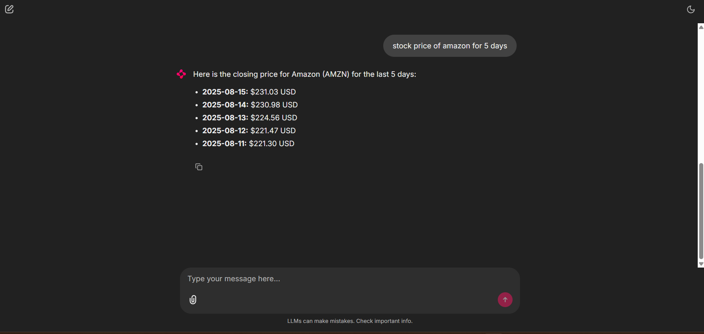

# Stock Price Chatbot with LangChain + OpenAI + Alpha Vantage

This project is a conversational AI Stock Chatbot built with LangChain and OpenAI, capable of fetching real-time stock prices from Alpha Vantage and converting them into USD, INR, and BTC.

The chatbot supports global stock markets (US, India, etc.) and responds naturally to user queries.

## Features

✅ Chat with AI using LangChain + OpenAI

✅ Fetch real-time stock prices via Alpha Vantage API

✅ Multi-currency support: USD, INR, BTC

✅ Handles US stocks (e.g., AAPL, MSFT), Indian stocks (INFY, RELIANCE.BSE), and more

✅ Environment variables for secure API key management

✅ Easy CLI interface (python main.py)

## Tech Stack

LangChain – for AI agent & tools

OpenAI – for natural language responses

Alpha Vantage – for stock data

forex-python – for currency conversion

Requests – for API calls

## Project Structure
📦 LANGCHAIN
 ┣ 📜 main.py            # Entry point - chatbot loop
 ┣ 📜 tool_handler.py    # Tool to fetch stock prices
 ┣ 📜 requirements.txt   # Dependencies
 ┣ 📜 .env               # API keys (not committed)
 ┗ 📜 README.md          # Project documentation

## Setup Instructions
1️⃣ Clone the repository
git clone https://github.com/your-username/langchain-stock-chatbot.git
cd langchain-stock-chatbot

2️⃣ Create & activate a virtual environment
python -m venv venv
venv\Scripts\activate    # On Windows
source venv/bin/activate # On Linux/Mac

3️⃣ Install dependencies
pip install -r requirements.txt

4️⃣ Add API keys

Create a .env file in the project root:

OPENAI_API_KEY=your_openai_api_key_here
ALPHA_VANTAGE_API_KEY=your_alpha_vantage_api_key_here

## Get your free Alpha Vantage key here: https://www.alphavantage.co/support/#api-key

5️⃣ Run the chatbot
python main.py

## Example Usage

## Known Issues

Alpha Vantage has free tier limits (5 requests/minute) → too many queries may show "Too Many Requests" error.

Some Indian stocks require .BSE or .NS suffix (e.g., RELIANCE.BSE).

## Future Improvements

Add Yahoo Finance fallback when Alpha Vantage is rate-limited

Web UI with Streamlit or React

More advanced financial analysis tools